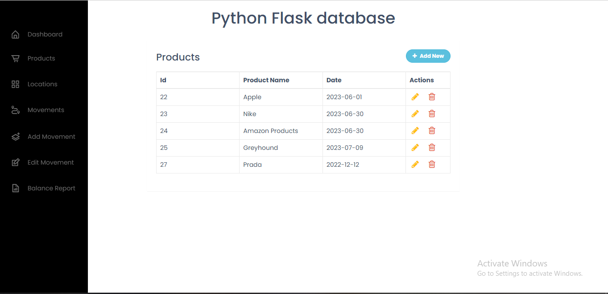
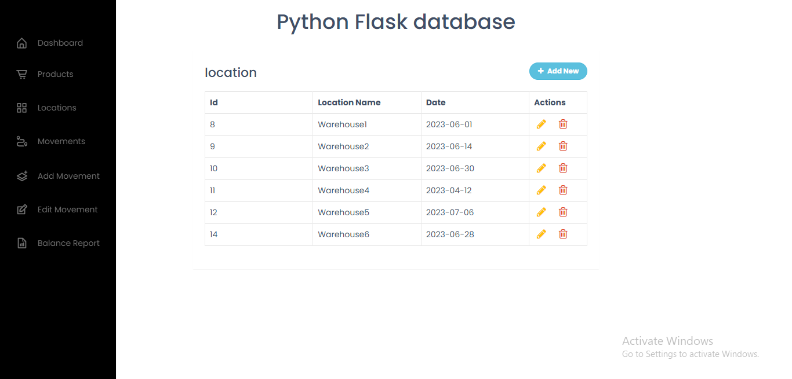
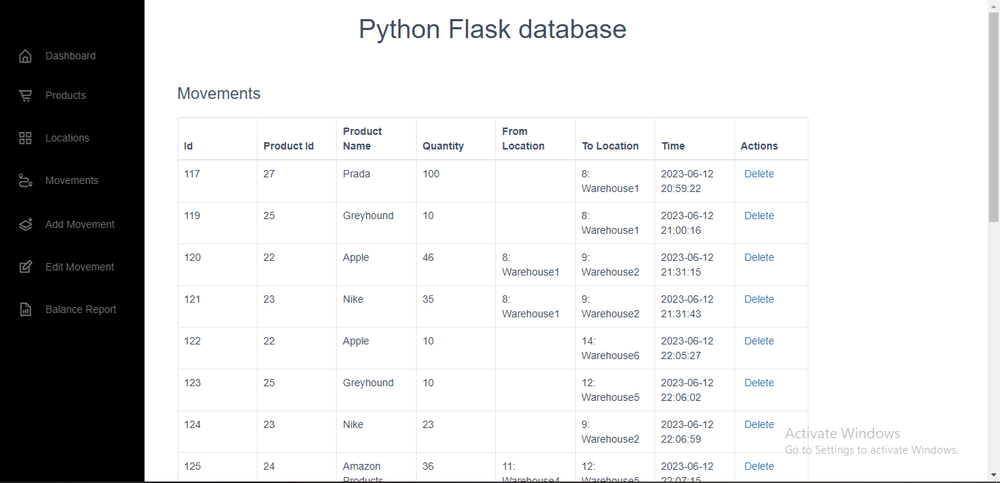
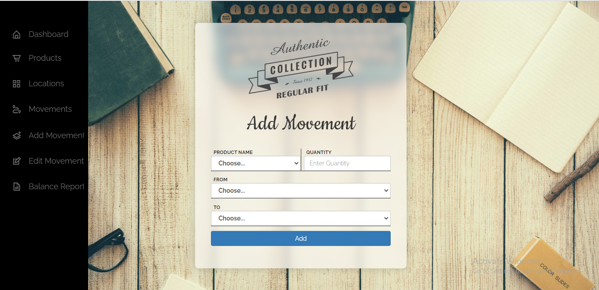
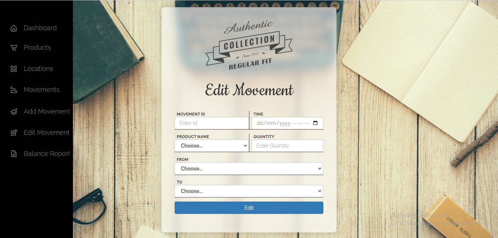
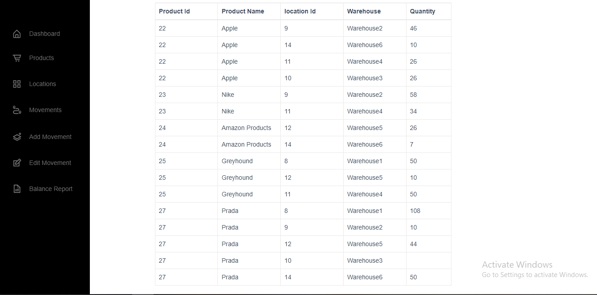

# Home
You can find the database inside the Database Folder and import it!
## Programming Test:
When You run the Application:
First You will go to the base page :

### The Products Page:
"This the page containing The Available products and you can add, edit and delete them" :

### The Locations Page:
"This the page containing The Available products and you can add, edit and delete them"

### The Movements Page:
"This the page containing The Available products and you can delete them"

### Add Movement Page:
"This the page is to add New Movement"

### Edit Movement Page:
"This the page is to edit an existing Movement"

### Balance Report Page:
"This the page shows the balanace report"

